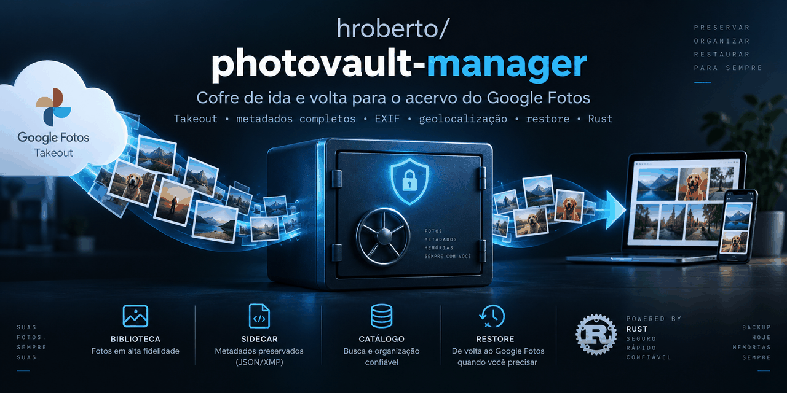

# PhotoVault Manager



Um cofre local para preservar o acervo do Google Fotos em formato aberto e auditável, com
restauração para o Google Fotos planejada. A CLI já importa exportações do Takeout, verifica
integridade e normaliza metadados; a autenticação e o envio ainda precisam ser integrados.

> O código, os comentários e a documentação estão em português, que é a língua do projeto.

## Navegação

- [Estado do projeto](#estado)
- [Instalação e uso](#uso)
- [Autenticação via OAuth](#autenticação-via-oauth)
- [Desenvolvimento](#desenvolvimento)
- [Índice da documentação](docs/README.md)
- [Roadmap](RoadMap.md)
- [Segurança](SECURITY.md)

---

## O problema

Desde 31 de março de 2025 a Google restringiu a Library API ao conteúdo criado pelo próprio
aplicativo. Isso muda o que é possível construir, e a maioria das ferramentas ainda parte de
premissas que não valem mais. Os fatos verificados contra a documentação oficial:

| Necessidade | Situação em 2026 |
| --- | --- |
| Listar toda a biblioteca | **Removido** — `mediaItems.list` não alcança mais o acervo do usuário |
| Selecionar itens existentes | Picker API, com seleção manual |
| Baixar bytes com GPS | **Não existe** — a API remove o bloco de geolocalização do EXIF |
| Export completo com metadados | Só Google Takeout, acionamento manual |
| Export programático | Data Portability API **não cobre** o Google Fotos |
| Enviar arquivos para a biblioteca | `photoslibrary.appendonly` — funciona |
| Criar álbuns e adicionar itens | Funciona, apenas em álbuns criados pelo próprio app |
| Marcar pessoas ou favoritos | **Não existe** |
| Apagar da biblioteca | **Não existe** |

Veja as [mudanças das APIs do Google Fotos](https://developers.google.com/photos/support/updates)
e os [escopos de autorização](https://developers.google.com/photos/overview/authorization).

Daí decorre a assimetria que organiza o projeto inteiro:

> **Sair do Google é manual e difícil. Voltar para o Google é programático e fácil.**

## A consequência não óbvia

A geolocalização **volta**. O Google Fotos lê o EXIF dos bytes que recebe — então basta embutir
no arquivo, antes de enviar, o `geoData` que o Takeout entregou no JSON lateral. O mesmo vale
para a data de captura.

O que não volta são nomes de pessoas e marcações de favorito, porque não há API para isso. O
PhotoVault preserva ambos no catálogo. A escrita em XMP está planejada para que também
viajem dentro dos arquivos. Hoje, `normalize` grava EXIF e informa os campos não embutidos;
instalar o ExifTool ainda não ativa uma integração de escrita automática.

---

## Estado

**V0.3 em desenvolvimento.** O núcleo de restauração existe, mas ainda não há restauração
executável pela CLI. Os marcos V0.x do roadmap são etapas de entrega; a versão declarada no
workspace Cargo é `0.1.0`.

| Componente | Estado |
| --- | --- |
| `crates/core` — domínio, sem dependência do Google | pronto |
| `crates/takeout` — parser do Takeout | pronto |
| `crates/cas` — armazenamento endereçado por conteúdo | pronto |
| `crates/catalog` — SQLite com SQLx | pronto |
| `crates/exif` — metadados embutidos | pronto |
| `crates/google` — Library API, OAuth, cota | cliente testado com servidor simulado; OAuth parcial |
| `crates/restore` — planejamento, idempotência, retomada | núcleo pronto |
| `crates/cli` — `photovault` | importação, verificação, normalização |
| `crates/advisor` — análise de limpeza | não iniciado |
| interface Tauri | não iniciada |

Para a primeira restauração real, faltam a configuração de um cliente OAuth no Google Cloud,
o fluxo completo de autorização, a persistência segura de tokens e a ligação entre o cliente
Google e a fila de restauração na CLI. Veja o [guia de OAuth](docs/oauth.md).

---

## O que o parser do Takeout resolve

O Takeout não tem especificação e o formato muda sem aviso. Estas armadilhas são tratadas com
fixtures e testes, não com suposições:

```text
IMG_1002.JPG.supplemental-metadata.json     formato atual
IMG_1002.JPG.supplemental-metadat.json      truncado
IMG_1002.JPG.supple.json                    truncado em outro ponto
IMG_1002.JPG.s.json                         truncado ao extremo
IMG_1002.JPG.json                           formato antigo

IMG_1002(1).JPG  ←→  IMG_1002.JPG(1).supplemental-metadata.json
                     o marcador de duplicata migra para depois da extensão

Aniversário.jpg  ←→  Aniversa<0301>rio.jpg.…json
                     NFC contra NFD, conforme a plataforma

IMG_1004.HEIC + IMG_1004.MP4     uma Live Photo, não duas fotos
IMG_1003-edited.JPG              derivada, não duplicata (12 idiomas)
```

Quando o casamento é ambíguo, o sidecar vira **órfão com o motivo e os candidatos registrados**.
Nunca um palpite silencioso: associar metadado à foto errada é o modo de falha que mais assusta
num acervo irrepetível.

---

## Princípios

1. O acervo é do usuário; o Google é apenas um dos destinos.
2. O original nunca é modificado — objetos no CAS são gravados em modo `0444`, e a imutabilidade
   é imposta pelo sistema de arquivos, não só documentada.
3. Os metadados viajam dentro dos arquivos, não presos a um banco proprietário.
4. Nada é apagado sem redundância verificada. **O PhotoVault nunca apaga nada no Google.**
5. O que não é possível é dito na tela, não descoberto pelo usuário.
6. Um backup que nunca foi restaurado não é um backup.

As decisões estão registradas em [`docs/adr/`](docs/adr/), com contexto e custo. O modelo de
ameaça e os avisos de segurança avaliados estão em [`SECURITY.md`](SECURITY.md).

---

## Uso

### Compilar

Requer a toolchain Rust estável, conforme [rust-toolchain.toml](rust-toolchain.toml).
Execute os comandos na raiz do repositório.

```bash
cargo build --release -p photovault-cli
./target/release/photovault --help
```

O build gera `target/release/photovault`; ele não instala o comando no `PATH`. Os exemplos
abaixo usam esse caminho. Para instalar o binário, use `cargo install --path crates/cli --locked`
e mantenha o diretório de binários do Cargo no `PATH`.

### Importar e verificar

Solicite a exportação no [Google Takeout](https://takeout.google.com/), selecionando apenas o
Google Fotos. Baixe e extraia os arquivos antes de importar. Esse fluxo local **não exige OAuth**.

```bash
# 1. Importe o diretório extraído; repita para cada parte da exportação.
./target/release/photovault import-takeout ./Takeout --vault ~/PhotoVault --label "arquivo 1 de 8"

# 2. Veja o que entrou.
./target/release/photovault status --vault ~/PhotoVault

# 3. Confira a integridade dos bytes em disco.
./target/release/photovault verify --vault ~/PhotoVault
./target/release/photovault verify --sample 2 --vault ~/PhotoVault

# 4. Grave os metadados dentro de cópias dos arquivos.
./target/release/photovault normalize --vault ~/PhotoVault

# 5. Reveja o que não casou. Nada foi descartado.
./target/release/photovault orphans --vault ~/PhotoVault
```

`verify --sample 2` verifica uma amostra de aproximadamente 2% dos objetos. Para experimentar
a normalização em poucos itens, use `normalize --limit 10`. Confira o relatório de campos
não embutidos e formatos sem suporte antes de considerar a normalização completa.

### Estrutura do cofre

```text
PhotoVault/
├── repository/objects/     bytes originais, imutáveis, endereçados por BLAKE3
├── derived/normalized/     cópias com metadados embutidos — descartável e reprodutível
└── database/photovault.db  catálogo
```

`repository/` contém os bytes originais. Para preservar também associações, álbuns e metadados
do catálogo, copie `database/` com o aplicativo fechado. `derived/` pode ser regenerado a partir
dos originais e do catálogo.

## Autenticação via OAuth

**Ainda não existe comando de login ou restauração na CLI.** Criar credenciais no Google Cloud
prepara a configuração externa, mas não habilita esses recursos nesta versão.

O [guia de OAuth](docs/oauth.md) explica como criar o projeto, configurar o consentimento,
obter um Client ID para aplicativo de computador e escolher os escopos. Também descreve o
fluxo PKCE com retorno local e as etapas que faltam implementar.

---

## Desenvolvimento

```bash
cargo test --workspace
cargo clippy --workspace --all-targets -- -D warnings
cargo fmt --all --check
cargo audit                                          # exige cargo-audit
```

O CI roda os quatro a cada push, e a auditoria também **semanalmente por agendamento** — o risco
real é uma CVE divulgada contra uma dependência que não mudou, e ela não seria notada se a
auditoria só rodasse quando alguém empurra código.

O crate `takeout` é o de maior risco técnico do projeto. Toda variação encontrada em um archive
real deve virar fixture **antes** de virar correção de código.

---

## Licença

MIT ou Apache-2.0, à escolha de quem usa.
